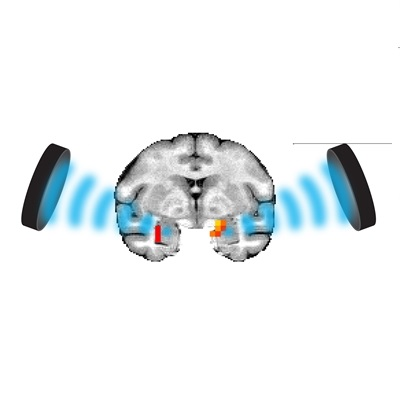

# Neuromodlab website

Welcome to the Neuromodlab website at Radboud University, hosted by GitHub Pages.
<div align="center">
  
</div>

## Usage

The preferred text editor is [Brackets](https://brackets.io/)

It's free to use and offers live editing view. 

To set it up, download the repository, open Brackets, and open the project FOLDER (the downloaded repository that is now local on your computer). 

If you need to edit some box sizes/colors/etc. then all of the styling can be found in assets>css>main. The specific styles for tables/gallery/etc are found in the smaller css files in that folder. 
The scripts are in assets>js. Do not touch these. 

The main pages are the page.html pages. They automatically load the header, footer and content pages. Preferably, do not touch the main html pages, unless you need to add a page somewhere. In that case, copy it and add also a content_page.html file, and let the main file link to the content file. 

The menu can be edited in header.html. 
The footer can be edited in footer.html.

The body of the pages are edited in content_page.html. 

### Live view
Click the lightning thing at the right top to open the live view. This views the pages correctly when you're on the main html page. It does not edit the content 'live', but when changing the content you can see what you are doing by saving the content file and opening the main html page file. 

## Home page
The background image is found in assets>css>images>pic11.jpg. This is an exception: replace this image (same name. same folder) to change the background. 
All of the other images on the website are in the folder named images. The images of the people are in another folder, namely people. 
If an image is not used anymore, don't forget to remove it from the folder (manually on github, as this does not happen automatically when uploading the repository). 

## Templates

### General

To add a paragraph, add

```bash
<p> [Paragraph text] </p>
```

To add a 'division'/section (multipurpose block), add
```bash
<div> [something] </div>
```

To make text bold, use
```bash
<b>This text is bold</b>
```

To make text italic, use
```bash
<i>This text is italic</i>
```

To add a sub/superscript, add
```bash
This is<sub> subscript</sub> and <sup>superscript</sup>
```

To add a title, use a header tag
```bash
<h1> Big title </h1>
<h2> Normal title </h2>
<h3> Small title </h3>
```

To add an image, add:
```bash

```
The file can be a link to an image online or a relative path, for example "images/index1.jpg"

To add a link, add:
```bash
<a href="[url]">[link text]</a>
```
The url can link to an online url or a relative path, for example "index.html"

When using images that have a better format, use
```bash

```
Instead of "right", you can also use
- "left" to place the image on the left of the text
- "fit" to make the image as wide as the text block
-  "mid" to place the image in the middle, but smaller

When you want a text block, with optionally a different background, put it in a div and add a class, e.g.
```bash
<div class="block">
	... text ...
</div>

<div class="block blockgrey">
	... text ...
</div>

<div class="block blockorange">
	... text ...
</div>
```
(for changing/adding block colors, go to main.css and ctrl+f for "blockgrey" or "blockorange")

To add a button with POPUP text, add
```bash
<!-- The POPUP (hidden before clicking) -->
<div class="modal">
	<div class="modal-content">
			<span class="close">&times;</span>

			<!-- The POPUP TEXT -->
			<h2>Title</h2>
			<p> Some text </p>
			<p> Maybe more paragraphs, images etc. </p>
			etc...
	</div>
</div>
<!-- BUTTON FOR POPUP -->
<button class="openmodal myBtn button">Read More</button>
```

### Home/index
This content page is a little confusing, but just replace the text where you can find it in the code. 

Note:
```bash
<a href="#one" class="goto-next scrolly">Next</a>
```
is the little arrow at the bottom of the section. This example is section one, by clicking you go to section with id 'one'. 

```bash
<section id="[number]" class="spotlight style1 bottom">
	<span class="image fit main"></span>
	<div class="content">
		...
	</div>
	<a href="#[next number]" class="goto-next scrolly">Next</a>
</section>
```
is the basic template for a new section. Change "bottom" for "right" or "left", for example, to change the layout. 
The last section does not have a 'scrolly' thing, because there is no next section to scroll to.


### Research
Nothing new

### News

Basic template for a news post:
```bash
<!-------------
    NEW POST
-------------->
<div class="block [optionally blockorange/blockgrey]">
    <p style="text-align:right;">
        [Date]
    </p>
    <h2>[Title]</h2>
	... text ...
</div>
<br><br>
```

Divider (for example, between new and old news posts):
```bash
<br><br><header class="major">
</header>
```

### Publications
Nothing new, just make sure to use italics and links as said above in general.

### People
To add a person, use template:
```bash
<!-------------
	NEW PERSON
 ------------->
<li>
<!-- The popup -->
<div class="modal">
	<!-- Modal content -->
	<div class="modal-content">
		<span class="close">&times;</span>
		<h2>[NAME]</h2>
		

		[TEXT about person]

	</div>
</div>
<!-- The overview button -->
<a class="profile openmodal">
  
  <h2 class="profile__name">[NAME]</h2>
  <p class = "titleorange">[TITLE text, eg 'student']</p>
</a>
</li>
```

### About us
Nothing new

### Contact
There are two columns 'contactcolumn' in a sort of table 'contactcolumns'. These collapse when using mobile. 
A new map can be embedded easily be google mapsing the location and doing share -> embed a map and copy pasting the iframe code. 
