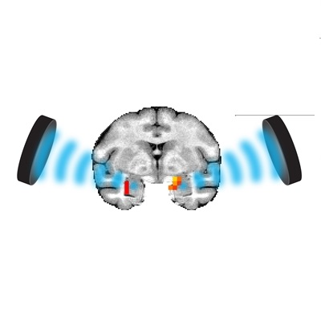

# Neuromodlab website

Welcome to the Neuromodlab website at Radboud University, hosted by GitHub Pages.
<div align="center">
  
</div>

## Usage

The preferred text editor is [Brackets](https://brackets.io/)

It's free to use and offers live editing view. 

To set it up, download the repository, open Brackets, and open the project FOLDER (the downloaded repository that is now local on your computer). 

If you need to edit some box sizes/colors/etc. then all of the styling can be found in assets>css>main. The specific styles for tables/gallery/etc are found in the smaller css files in that folder. 
The scripts are in assets>js. Do not touch these. 

The main pages are the page.html pages. They automatically load the header, footer and content pages. Preferably, do not touch the main html pages, unless you need to add a page somewhere. In that case, copy it and add also a content_page.html file, and let the main file link to the content file. 

The menu can be edited in header.html. 
The footer can be edited in footer.html.

The body of the pages are edited in content_page.html. 

## Home page
The background image is found in assets>css>images>pic11.jpg. This is an exception: replace this image (same name. same folder) to change the background. 
All of the other images on the website are in the folder named images. The images of the people are in another folder, namely people. 
If an image is not used anymore, don't forget to remove it from the folder (manually on github, as this does not happen automatically when uploading the repository). 

## Templates

### Basic code

To add a paragraph, add <p>

```bash
<p> [Paragraph text] </p>
```

To add a new/white line, add <br>

```bash
[Title or some other text] <br><br>
```

